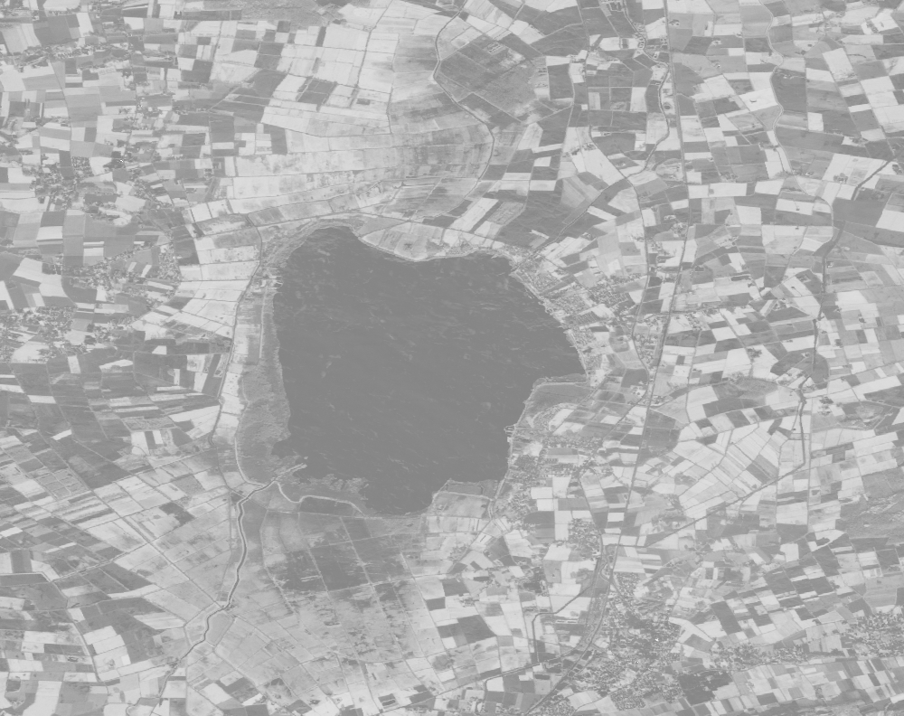

# NDVI (POC Use Case 1)

This example derives maximum NDVI measurements over pixel time series of Sentinel 2 imagery.

This process graph is meant to be used as secondary web service. If you want to run it as a batch job, you'd need to store the results to a file with the `save_result` process.

This process graph assumes the dataset is called `Sentinel-2`. It receives the spatial extent for the data to compute from the secondary web service as variables in `spatial_extent_west`, `spatial_extent_east` etc. The temporal extent covered is January 2018.

Process Graph #1 computes the NDVI based on the common band names in the metadata. If these entries are not available, you'd need to switch the process to `normalized_difference` in combination with `filter_bands` to manually specify the red and nir bands. This is shown in Process Graph #2.

## Process Graphs

### #1

```json
{
  "loadco1": {
    "process_id": "load_collection",
    "arguments": {
      "id": "Sentinel-2",
      "spatial_extent": {
        "west": {
          "variable_id": "spatial_extent_west"
        },
        "east": {
          "variable_id": "spatial_extent_east"
        },
        "north": {
          "variable_id": "spatial_extent_north"
        },
        "south": {
          "variable_id": "spatial_extent_south"
        }
      },
      "temporal_extent": [
        "2018-01-01",
        "2018-02-01"
      ]
    }
  },
  "ndvi1": {
    "process_id": "ndvi",
    "arguments": {
      "data": {
        "from_node": "loadco1"
      }
    }
  },
  "reduce1": {
    "process_id": "reduce",
    "arguments": {
      "data": {
        "from_node": "ndvi1"
      },
      "dimension": "temporal",
      "reducer": {
        "callback": {
          "max1": {
            "process_id": "max",
            "arguments": {
              "data": {
                "from_argument": "data"
              }
            },
            "result": true
          }
        }
      }
    },
    "result": true
  }
}
```

### #2

```json
{
  "load_collection": {
    "arguments": {
      "id": "Sentinel-2",
      "spatial_extent": {
        "west": {
          "variable_id": "spatial_extent_west"
        },
        "east": {
          "variable_id": "spatial_extent_east"
        },
        "north": {
          "variable_id": "spatial_extent_north"
        },
        "south": {
          "variable_id": "spatial_extent_south"
        }
      },
      "temporal_extent": [
        "2018-01-01",
        "2018-02-01"
      ]
    },
    "process_id": "load_collection"
  },
  "b1": {
    "arguments": {
      "data": {
        "from_node": "load_collection"
      },
      "bands": [
        "B4"
      ]
    },
    "process_id": "filter_bands"
  },
  "b2": {
    "arguments": {
      "data": {
        "from_node": "load_collection"
      },
      "bands": [
        "B8"
      ]
    },
    "process_id": "filter_bands"
  },
  "normalized_difference": {
    "arguments": {
      "band1": {
        "from_node": "b1"
      },
      "band2": {
        "from_node": "b2"
      }
    },
    "process_id": "normalized_difference"
  },
  "reduce": {
    "arguments": {
      "data": {
        "from_node": "normalized_difference"
      },
      "dimension": "temporal",
      "reducer": {
        "callback": {
          "max": {
            "arguments": {
              "data": {
                "from_argument": "data"
              }
            },
            "process_id": "max",
            "result": true
          }
        }
      }
    },
    "process_id": "reduce"
  }
}
```

## Result

Executing this process graph on Google Earth Engine gives the following exemplary results for a user-defined area:

